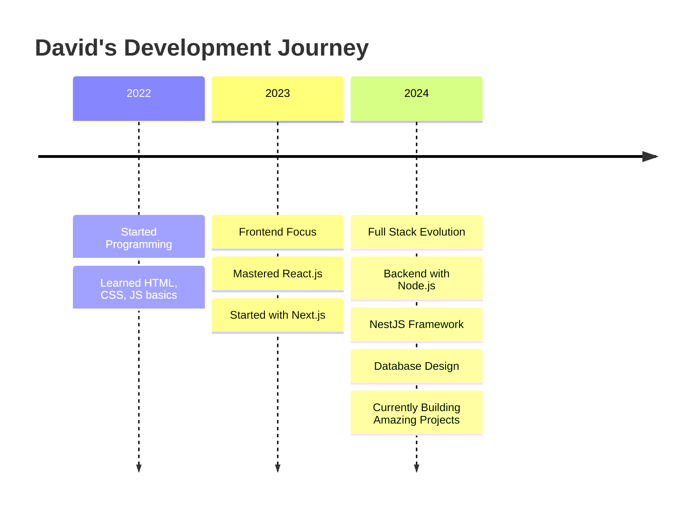

<!--
🎨 PLANTILLA V3 - MINIMALISTA ELEGANTE 🎨
Grend Leard - El Arte del Código Limpio
-->

<div align="center">

<!-- ELEGANT HEADER -->


<!-- ELEGANT TYPING EFFECT -->
<a href="https://git.io/typing-svg">
  
</a>

<!-- SOCIAL BADGES -->
<p>
  
  
  
</p>

</div>

---

## 👋 **Acerca de Mí**


```typescript
interface Developer {
  name: string;
  role: string;
  location: string;
  languages: string[];
  currentFocus: string[];
  hobbies: string[];
  lifePhilosophy: string;
}

const david: Developer = {
  name: "David",
  role: "Full Stack Developer",
  location: "Colombia",
  languages: ["JavaScript", "TypeScript", "Python", "Spanish", "English"],
  currentFocus: ["Next.js", "NestJS", "React", "PostgreSQL"],
  hobbies: ["Gaming 🎮", "Chess ♟️", "Learning new tech"],
  lifePhilosophy: "Clean code is not written by following a set of rules. You don't become a software craftsman by learning a list of heuristics. Professionalism and craftsmanship come from values that drive disciplines."
};
```

<br clear="both"/>

---

## 🛠️ **Stack Tecnológico**

<div align="center">

### Frontend Arsenal 
<div>
  
  
  
  
  
</div>

### Backend Powerhouse
<div>
  
  
  
  
  
</div>

### Database & Cloud
<div>
  
  
  
  
  
</div>

</div>

---

## 📈 **GitHub Analytics**

<div align="center">
  
<table>
<tr>
<td width="50%">


</td>
<td width="50%">


</td>
</tr>
</table>


</div>

---

## 🏗️ **Mi Journey como Developer**

<div align="center">



</div>

---

## 🎯 **Habilidades & Competencias**

<div align="center">

| 🎨 Frontend | 🏗️ Backend | 🗄️ Database | ☁️ DevOps | 🧠 Soft Skills |
|-------------|-------------|-------------|-----------|---------------|
| React ⭐⭐⭐⭐⭐ | Node.js ⭐⭐⭐⭐⭐ | PostgreSQL ⭐⭐⭐⭐ | Docker ⭐⭐⭐ | Problem Solving ⭐⭐⭐⭐⭐ |
| Next.js ⭐⭐⭐⭐ | NestJS ⭐⭐⭐⭐ | MongoDB ⭐⭐⭐⭐ | AWS ⭐⭐⭐ | Team Work ⭐⭐⭐⭐⭐ |
| JavaScript ⭐⭐⭐⭐⭐ | Python ⭐⭐⭐⭐ | Redis ⭐⭐⭐ | Git ⭐⭐⭐⭐⭐ | Communication ⭐⭐⭐⭐ |
| TypeScript ⭐⭐⭐⭐ | Express ⭐⭐⭐⭐⭐ | MySQL ⭐⭐⭐ | Linux ⭐⭐⭐⭐ | Adaptability ⭐⭐⭐⭐⭐ |

</div>

---

## 🚀 **Proyectos Destacados**

<div align="center">

<!-- PROJECT CARDS -->
<table>
<tr>
<td width="50%">

### 🌟 E-Commerce Platform
**Tech Stack:** Next.js, NestJS, PostgreSQL, Redis
- 🛒 Complete shopping experience
- 💳 Payment gateway integration  
- 📱 Responsive design
- ⚡ Real-time notifications

[](https://github.com/GREND-LEARD/ecommerce-project)

</td>
<td width="50%">

### 🎯 Task Management App
**Tech Stack:** React, Express, MongoDB, Socket.io
- ✅ Real-time collaboration
- 📊 Progress tracking
- 🔔 Smart notifications
- 🎨 Beautiful UI/UX

[](https://github.com/GREND-LEARD/task-manager)

</td>
</tr>
</table>

</div>

---

## 📊 **Este Mes en Números**

<div align="center">

<table>
<tr>
<td align="center">

<br>
<sub><b>Fuel para programar</b></sub>
</td>
<td align="center">

<br>
<sub><b>Líneas de código</b></sub>
</td>
<td align="center">

<br>
<sub><b>Nueva tecnología</b></sub>
</td>
<td align="center">

<br>
<sub><b>Tiempo de descanso</b></sub>
</td>
</tr>
</table>

</div>

---

## 🌐 **Conecta Conmigo**

<div align="center">

[](mailto:tu-email@gmail.com)
[](https://linkedin.com/in/tu-linkedin)
[](https://twitter.com/tu-twitter)
[](https://tu-portfolio.com)
[](https://discord.gg/tu-discord)

</div>

---

## 🎵 **Currently Vibing To**

<div align="center">
  
[](https://open.spotify.com/user/tu-spotify)

</div>

---

## 💭 **Quote del Día**

<div align="center">
  
</div>

---

## 🐍 **Contribution Snake**

<div align="center">
  
</div>

---

## 🏆 **GitHub Trophies**

<div align="center">
  
</div>

---

<div align="center">

### 💫 **"Code is like humor. When you have to explain it, it's bad."** 💫


**🌟 ¡Gracias por visitar mi perfil! Si te gusta mi trabajo, dale una estrella ⭐**


</div>
