<!--
🔮 PLANTILLA V5 - GLASSMORPHISM FUTURISTA 🔮
David Grend Leard - Arquitecto del Futuro Digital
-->

<div align="center">

<!-- HOLOGRAPHIC HEADER -->


<!-- HOLOGRAPHIC TYPING -->
<a href="https://git.io/typing-svg">
  
</a>

<!-- GLASS BADGES -->
<p>
  
  
  
</p>

<!-- FLOATING COUNTERS -->


</div>

---

<div align="center">

## 🔮 **HOLOGRAPHIC DEVELOPER INTERFACE**

<table>
<tr>
<td width="50%">

```typescript
interface FutureArchitect {
  readonly name: "David";
  readonly dimension: "Digital Reality";
  readonly specialty: "Glass Architecture";
  readonly location: "COL Metaverse COL";
  readonly vision: "Holographic";
  readonly energy: "Crystal Powered";
}

class GlassDeveloper implements FutureArchitect {
  private crystalPower = 100;
  
  constructor() {
    this.initializeHologram();
    this.loadGlassFrameworks();
  }
  
  createTransparentMagic(): void {
    while (this.crystalPower > 0) {
      this.designGlassUIs();
      this.buildFloatingComponents();
      this.craftHolographicApps();
      this.refractLight();
    }
  }
  
  getHolographicSkills() {
    return [
      "🔮 Glass UI Design",
      "✨ Transparent Architecture", 
      "🌈 Holographic Animations",
      "💎 Crystal Clear Code"
    ];
  }
}
```

</td>
<td width="50%">


</td>
</tr>
</table>

</div>

---

## 💎 **CRYSTAL TECH ECOSYSTEM**

<div align="center">

<!-- GLASS CONTAINERS -->
<table style="background: linear-gradient(135deg, rgba(255,255,255,0.1), rgba(255,255,255,0.05)); backdrop-filter: blur(10px); border-radius: 20px; border: 1px solid rgba(255,255,255,0.18);">

<tr>
<td align="center">

### ✨ **Frontend Crystals**
<div>


<br>


</div>

</td>
</tr>

<tr>
<td align="center">

### 🔥 **Backend Holograms**
<div>


<br>


</div>

</td>
</tr>

<tr>
<td align="center">

### 🌊 **Data Streams**
<div>


<br>


</div>

</td>
</tr>

<tr>
<td align="center">

### ☁️ **Cloud Dimension**
<div>


<br>


</div>

</td>
</tr>

</table>

</div>

---

## 📊 **HOLOGRAPHIC ANALYTICS**

<div align="center">

<table>
<tr>
<td width="50%">


</td>
<td width="50%">


</td>
</tr>
</table>


</div>

---

## 🌈 **CRYSTAL DEVELOPMENT PIPELINE**

```mermaid
graph TD
    A[💡 Holographic Idea] --> B[🔮 Crystal Planning]
    B --> C[✨ Glass Design]
    C --> D[💎 Transparent Code]
    D --> E[🌈 Refraction Testing]
    E --> F[🚀 Hologram Deploy]
    F --> G[📊 Light Analytics]
    
    style A fill:#ff69b4,stroke:#fff,stroke-width:2px,color:#fff
    style B fill:#00d4ff,stroke:#fff,stroke-width:2px,color:#fff
    style C fill:#9945ff,stroke:#fff,stroke-width:2px,color:#fff
    style D fill:#00ff88,stroke:#fff,stroke-width:2px,color:#fff
    style E fill:#ffaa00,stroke:#fff,stroke-width:2px,color:#fff
    style F fill:#ff4757,stroke:#fff,stroke-width:2px,color:#fff
    style G fill:#5f27cd,stroke:#fff,stroke-width:2px,color:#fff
```

<div align="center">



</div>

---

## 🎯 **HOLOGRAPHIC SKILL MATRIX**

<div align="center">

<table>
<tr>
<td align="center" width="33%">

### 🔮 **Glass Frontend**
| Technology | Level |
|------------|-------|
| React ⚛️ | ████████████████████ 95% |
| Next.js ⚡ | ██████████████████░░ 90% |
| TypeScript 🔵 | █████████████████░░░ 88% |
| JavaScript ⭐ | ████████████████████ 95% |
| Tailwind CSS 🎨 | █████████████████░░░ 85% |

</td>
<td align="center" width="33%">

### ✨ **Crystal Backend**
| Technology | Level |
|------------|-------|
| Node.js 🟢 | ██████████████████░░ 92% |
| NestJS 🔥 | █████████████████░░░ 88% |
| Python 🐍 | █████████████████░░░ 85% |
| Express ⚡ | ██████████████████░░ 90% |
| GraphQL 💜 | ████████████████░░░░ 82% |

</td>
<td align="center" width="33%">

### 🌊 **Data Streams**
| Technology | Level |
|------------|-------|
| PostgreSQL 🐘 | █████████████████░░░ 87% |
| MongoDB 🍃 | ████████████████░░░░ 83% |
| Redis 🔴 | ████████████████░░░░ 80% |
| MySQL 🗄️ | ███████████████░░░░░ 75% |
| Prisma 💎 | ███████████████░░░░░ 78% |

</td>
</tr>
</table>

### 🚀 **Additional Skills**

<div align="center">

| 🛠️ **DevOps & Tools** | 🎨 **Design & UI/UX** | 🧠 **Soft Skills** |
|----------------------|----------------------|------------------|
| Git & GitHub ████████████████████ 95% | Figma ████████████████░░░ 80% | Problem Solving ████████████████████ 100% |
| Docker ███████████████░░░░░ 75% | UI/UX Design ████████████████░░░ 82% | Team Collaboration ██████████████████░░ 95% |
| AWS ██████████████░░░░░░ 70% | Responsive Design ████████████████████ 95% | Communication ██████████████████░░ 90% |
| Linux ████████████████░░░░ 80% | Animation (CSS/JS) ███████████████░░░░░ 75% | Learning Agility ████████████████████ 100% |

</div>

</div>

---

## 🚀 **CRYSTAL PROJECTS SHOWCASE**

<div align="center">

<table>
<tr>
<td width="50%">

### 🔮 **Carpinvel SAS - Business Platform**
```yaml
Tech Stack: 
  Frontend: TypeScript + Modern UI
  Backend: Advanced Business Logic
  Database: Enterprise Solutions
  
Features:
  🏢 Corporate Management System
  💼 Business Process Automation
  📊 Advanced Analytics Dashboard
  ⚡ Real-time Business Intelligence
```

[](https://github.com/GREND-LEARD/carpinvel-sas)

</td>
<td width="50%">

### 💎 **Finanzas App - Personal Finance**
```yaml
Tech Stack:
  Frontend: JavaScript + Modern CSS
  Backend: RESTful APIs + Database
  Features: Personal Finance Management
  
Features:
  📊 Financial Dashboard
  💰 Expense Tracking System  
  📈 Income & Budget Analytics
  ⚡ Smart Financial Reports
```

[](https://github.com/GREND-LEARD/finanzas-app)

</td>
</tr>
</table>

</div>

---

## 🚀 **ALL MY CRYSTAL REPOSITORIES**

<div align="center">

### 💎 **Featured Projects Gallery**

<table>
<tr>
<td width="33%">

[](https://github.com/GREND-LEARD/carpinvel-sas)

</td>
<td width="33%">

[](https://github.com/GREND-LEARD/ProyectoNest)

</td>
<td width="33%">

[](https://github.com/GREND-LEARD/finanzas-app)

</td>
</tr>
<tr>
<td width="33%">

[](https://github.com/GREND-LEARD/english-app)

</td>
<td width="33%">

[](https://github.com/GREND-LEARD/REACT--PokeAPI)

</td>
<td width="33%">

[](https://github.com/GREND-LEARD/Juego-APP)

</td>
</tr>
</table>

### 🔮 **More Crystal Projects**

| 🐍 **Python Projects** | 📊 **Data Science** | 🎯 **Learning & More** |
|------------------------|---------------------|------------------------|
| [](https://github.com/GREND-LEARD/CODES-PY) | [](https://github.com/GREND-LEARD/ELECTIVA-PROFESIONAL-III) | [](https://github.com/GREND-LEARD/Frontend) |
| [](https://github.com/GREND-LEARD/python.py) | | [](https://github.com/GREND-LEARD/fakeapi) |

</div>

---

## 🌟 **HOLOGRAPHIC ACHIEVEMENTS**

<div align="center">
  
</div>

---

## 💫 **CRYSTAL ACTIVITY SPECTRUM**

<div align="center">
  
</div>

---

## 🔮 **FUTURE DEVELOPMENT GOALS**

<div align="center">

```typescript
interface FutureGoals2025 {
  readonly current: {
    🏢 carpinvelSAS: "Business Platform Enhancement";
    🔥 nestJSMastery: "Advanced Backend Architecture";
    💰 finanzasApp: "Personal Finance Evolution";
    🎮 gamingProjects: "Interactive Entertainment";
  };
  
  readonly upcoming: {
    🚀 fullStackMastery: "Complete MERN/NEST Stack";
    🌊 realTimeApps: "WebSocket & Live Features";
    ⚡ performanceOptimization: "Speed & Efficiency";
    🎯 businessSolutions: "Enterprise Applications";
    🔮 modernUIUX: "Glassmorphism & 3D Interfaces";
  };
}
```

### 🎯 **2025 Roadmap**
- ✅ Complete NestJS Advanced Course
- ⏳ Launch Carpinvel SAS v2.0
- ⏳ Build 3 More Full-Stack Projects  
- ⏳ Master TypeScript Advanced Patterns
- ⏳ Create Personal Portfolio Website

</div>

---

## 🌐 **CONNECT ACROSS DIMENSIONS**

<div align="center">

[](mailto:tu-email@gmail.com)
[](https://linkedin.com/in/tu-linkedin)
[](https://twitter.com/tu-twitter)
[](https://discord.gg/tu-discord)
[](https://tu-portfolio.com)

</div>

---

## 🎵 **CRYSTALLINE FREQUENCIES**

<div align="center">
  
  [](https://open.spotify.com/user/tu-spotify)
  
  ### ✨ **Current Holographic Vibes**
  ```
  🎵 Genre: Future Bass / Synthwave / Ambient
  🔮 Mood: Crystalline Focus Mode
  ⚡ Energy: Holographic Flow State
  💎 Effect: Maximum Crystal Clarity
  ```
  
</div>

---

## 🌈 **QUANTUM WISDOM**

<div align="center">
  
</div>

---

## 🔮 **HOLOGRAPHIC SNAKE**

<div align="center">
  
</div>

---

<!-- CRYSTAL FOOTER -->
<div align="center">
  
</div>

<div align="center">

### 🔮 *"Code is the new crystal, transparency is the new black, and holograms are the future"* 🔮


**✨ Welcome to the Glass Dimension of Development ✨**


</div>
